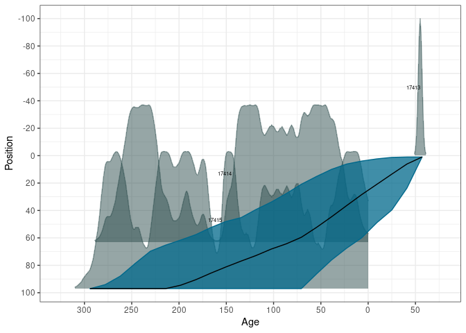

```r
options(warn = -1)
suppressMessages(library(neotoma2))
suppressMessages(library(sf))
suppressMessages(library(geojsonsf))
suppressMessages(library(dplyr))
suppressMessages(library(ggplot2))
```

Let's start by pulling in a record from the Czech Republic:


```r
stara <- get_downloads(24238)
```

```
## .
```

```r
stara_chron <- chronologies(stara)

stara_chron %>% as.data.frame() %>% 
  DT::datatable(data = .)
```

```{=html}
<div id="htmlwidget-636867f3ddd4436a22ad" style="width:100%;height:auto;" class="datatables html-widget"></div>
<script type="application/json" data-for="htmlwidget-636867f3ddd4436a22ad">{"x":{"filter":"none","vertical":false,"data":[["1","2","3"],["14589","14590","14591"],["C14 BP age with Tilia (Grimm)","CAL BP age with CLKAM (Blaauw) sigma 2","linear interpolation between neighbouring dated levels"],["linear interpolation","linear interpolation","Clam"],[2050,2000,2000],[5,400,400],[1,0,1],["2013-01-01","2013-01-01","2007-06-20"],["Radiocarbon years BP","Calibrated radiocarbon years BP","Calibrated radiocarbon years BP"],["C14 BP","CAL BP","PALYCZ"]],"container":"<table class=\"display\">\n  <thead>\n    <tr>\n      <th> <\/th>\n      <th>chronologyid<\/th>\n      <th>notes<\/th>\n      <th>agemodel<\/th>\n      <th>ageboundolder<\/th>\n      <th>ageboundyounger<\/th>\n      <th>isdefault<\/th>\n      <th>dateprepared<\/th>\n      <th>modelagetype<\/th>\n      <th>chronologyname<\/th>\n    <\/tr>\n  <\/thead>\n<\/table>","options":{"columnDefs":[{"className":"dt-right","targets":[4,5,6]},{"orderable":false,"targets":0}],"order":[],"autoWidth":false,"orderClasses":false}},"evals":[],"jsHooks":[]}</script>
```

There are three chronologies here, but for whatever reason we've decided not to use any of them.  We want to build a new one with `Bchron`. First we want to see what chroncontrols we have for the prior chronologies. We're going to select the chronologies used for chronology `14591` as our template.  


```r
controls <- chroncontrols(stara) %>% 
  dplyr::filter(chronologyid == 14591) %>% 
  arrange(depth)

controls %>% DT::datatable(data = .)
```

```{=html}
<div id="htmlwidget-72667decbe00d2d5765f" style="width:100%;height:auto;" class="datatables html-widget"></div>
<script type="application/json" data-for="htmlwidget-72667decbe00d2d5765f">{"x":{"filter":"none","vertical":false,"data":[["1","2","3","4","5"],[15771,15771,15771,15771,15771],[14591,14591,14591,14591,14591],[0,7.5,62.5,122.5,227.5],[null,5,5,5,5],[null,730,950,1320,1990],[53783,53779,53780,53781,53782],[null,610,810,1160,1850],[null,670,880,1240,1920],["Core top","Radiocarbon","Radiocarbon","Radiocarbon","Radiocarbon"]],"container":"<table class=\"display\">\n  <thead>\n    <tr>\n      <th> <\/th>\n      <th>siteid<\/th>\n      <th>chronologyid<\/th>\n      <th>depth<\/th>\n      <th>thickness<\/th>\n      <th>agelimitolder<\/th>\n      <th>chroncontrolid<\/th>\n      <th>agelimityounger<\/th>\n      <th>chroncontrolage<\/th>\n      <th>chroncontroltype<\/th>\n    <\/tr>\n  <\/thead>\n<\/table>","options":{"columnDefs":[{"className":"dt-right","targets":[1,2,3,4,5,6,7,8]},{"orderable":false,"targets":0}],"order":[],"autoWidth":false,"orderClasses":false}},"evals":[],"jsHooks":[]}</script>
```

We can look at other tools to decided how we want to manage the chron controls.  For example, we could add a new date, but here we're just going to modify the existing ages to provide a better core top age:


```r
controls$chroncontrolage[1] <- 0
controls$agelimityounger[1] <- -2
controls$agelimitolder[1] <- 2
controls$thickness[1] <- 1

controls %>% DT::datatable(data = .)
```

```{=html}
<div id="htmlwidget-278f874c7d18ca99ebe4" style="width:100%;height:auto;" class="datatables html-widget"></div>
<script type="application/json" data-for="htmlwidget-278f874c7d18ca99ebe4">{"x":{"filter":"none","vertical":false,"data":[["1","2","3","4","5"],[15771,15771,15771,15771,15771],[14591,14591,14591,14591,14591],[0,7.5,62.5,122.5,227.5],[1,5,5,5,5],[2,730,950,1320,1990],[53783,53779,53780,53781,53782],[-2,610,810,1160,1850],[0,670,880,1240,1920],["Core top","Radiocarbon","Radiocarbon","Radiocarbon","Radiocarbon"]],"container":"<table class=\"display\">\n  <thead>\n    <tr>\n      <th> <\/th>\n      <th>siteid<\/th>\n      <th>chronologyid<\/th>\n      <th>depth<\/th>\n      <th>thickness<\/th>\n      <th>agelimitolder<\/th>\n      <th>chroncontrolid<\/th>\n      <th>agelimityounger<\/th>\n      <th>chroncontrolage<\/th>\n      <th>chroncontroltype<\/th>\n    <\/tr>\n  <\/thead>\n<\/table>","options":{"columnDefs":[{"className":"dt-right","targets":[1,2,3,4,5,6,7,8]},{"orderable":false,"targets":0}],"order":[],"autoWidth":false,"orderClasses":false}},"evals":[],"jsHooks":[]}</script>
```

Once our controls table is updated we extract the depths and analysisunitids from the samples for the dataset. Pulling in both depths and analysisunit IDs is important because a single collection unit may have multiple datasets, which have non-overlapping depth sequences. So, when adding the sample ages back to a record we use the analysis unit ID to make sure we are providing the correct assignment.


```r
predictDepths <- samples(stara) %>%
  select(depth, analysisunitid) %>% 
  unique() %>% 
  arrange(depth)

newChron <- Bchron::Bchronology(ages = controls$chroncontrolage,
                                ageSds = abs(controls$agelimityounger - 
                                               controls$chroncontrolage),
                                calCurves = c("normal", rep("intcal20", 4)),
                                positionThicknesses = controls$thickness,
                                positions = controls$depth,
                                allowOutside = TRUE,
                                ids = controls$chroncontrolid)

newpredictions <- predict(newChron, predictDepths$depth)
```


```r
plot(newChron) +
  ggplot2::labs(
    title = "Stará Boleslav",
    xlab = "Age (cal years BP)",
    ylab = "Depth (cm)"
  )
```

<!-- -->

Now we want to create the metadata for the new chronology, using the properties from the [`chronology` table in Neotoma](https://open.neotomadb.org/dbschema/tables/chronologies.html):


```r
newChronStara <- set_chronology(agemodel = "Bchron model",
                           isdefault = 1,
                           ageboundolder = max(newpredictions),
                           ageboundyounger = min(newpredictions),
                           dateprepared = lubridate::today(),
                           modelagetype = "Calibrated radiocarbon years BP",
                           chronologyname = "Simon's example chronology",
                           chroncontrols = controls)

newChronStara$notes <- 'newChron <- Bchron::Bchronology(ages = controls$chroncontrolage,
                                ageSds = abs(controls$agelimityounger - 
                                               controls$chroncontrolage),
                                calCurves = c("normal", rep("intcal20", 4)),
                                positionThicknesses = controls$thickness,
                                positions = controls$depth,
                                allowOutside = TRUE,
                                ids = controls$chroncontrolid,
                                predictPositions = predictDepths)'
```

Once we've created the chronology we need to apply it back to the collectionunit we want to associate it with, and we need to add all the dates into the samples for each dataset associated with the collectionunit.  So, we have a collectionunit in `stara` that is accessible at `stara[[1]]$collunits`. We can use the function `add_chronology()`, which takes the chronology object and a `data.frame()` of sample ages:


```r
newSampleAges <- data.frame(predictDepths,
                            age = colMeans(newpredictions),
                            ageolder = colMeans(newpredictions) + 
                              apply(newpredictions, 2, sd),
                            ageyounger = colMeans(newpredictions) - 
                              apply(newpredictions, 2, sd),
                            agetype = "Calibrated radiocarbon years")

stara[[1]]$collunits[[1]] <- add_chronology(stara[[1]]$collunits[[1]], newChronStara, newSampleAges)
```

